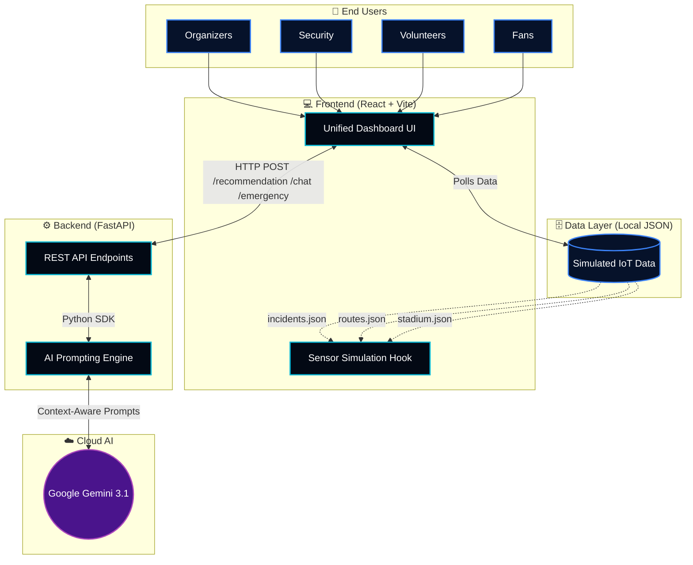

<div align="center">

# 🏟️ StadiumMind AI

**GenAI Smart Stadium Operations Platform for FIFA World Cup 2026**

<p align="center">
  
  
  
  
  
  
</p>

A unified, real-time command center prototype built for the **FIFA World Cup 2026 Smart Stadiums & Tournament Operations Hackathon**.

[Explore Features](#-key-features) • [View Architecture](#-system-architecture) • [Demo Flow](#-demo-flow) • [Installation](#-installation--setup)

---
</div>

## 🎯 The Vision

Managing a massive stadium during a global tournament like the FIFA World Cup is incredibly complex. Organizers face dynamic challenges ranging from unexpected crowd bottlenecks and shifting weather conditions to critical security and medical emergencies. 

**StadiumMind AI** solves this by unifying the entire stadium ecosystem into a single, GenAI-powered platform. By bridging the gap between fans, volunteers, security personnel, and top-level organizers, the platform transforms static data into proactive, actionable intelligence.

*(Note: This prototype utilizes local JSON files to simulate live IoT telemetry to demonstrate the software architecture without hardware dependencies.)*

---

## ✨ Key Features

<table>
  <tr>
    <td width="50%">
      <h3>🎛️ AI Control Dashboard</h3>
      <ul>
        <li>Live stadium overview with real-time visitor statistics.</li>
        <li>Crowd density heatmap covering key sectors.</li>
        <li>AI-generated risk predictions and operational recommendations.</li>
      </ul>
    </td>
    <td width="50%">
      <h3>🧭 Smart Indoor Navigation</h3>
      <ul>
        <li>Searchable seat, gate, washroom, and food court locators.</li>
        <li>Step-by-step walking directions with intuitive icons.</li>
        <li>Zero reliance on external GPS or mapping APIs.</li>
      </ul>
    </td>
  </tr>
  <tr>
    <td width="50%">
      <h3>🚨 AI Emergency Response</h3>
      <ul>
        <li>Instant triggers for Medical, Fire, Lost Child, and Security incidents.</li>
        <li>AI-generated response plans including priority levels.</li>
        <li>Auto-drafted PA scripts and volunteer instructions.</li>
      </ul>
    </td>
    <td width="50%">
      <h3>🤝 AI Volunteer Allocation</h3>
      <ul>
        <li>Dynamic volunteer task allocation based on live density shifts.</li>
        <li>Automated crowd redistribution suggestions.</li>
        <li>Security deployment recommendations with estimated impact metrics.</li>
      </ul>
    </td>
  </tr>
  <tr>
    <td width="50%">
      <h3>💬 AI Fan Assistant</h3>
      <ul>
        <li>Natural language chatbot powered by Google Gemini.</li>
        <li>Multilingual assistance for global tourists.</li>
        <li>Context-aware answers regarding stadium FAQs and navigation.</li>
      </ul>
    </td>
    <td width="50%">
      <h3>📊 Live Analytics Dashboard</h3>
      <ul>
        <li>Live-updating historical charts powered by Chart.js.</li>
        <li>Visitor trends, queue monitoring, and density tracking.</li>
        <li>Historical tracking for security alerts and medical requests.</li>
      </ul>
    </td>
  </tr>
</table>

---

<details>
<summary><b>📸 Click to View Screenshots</b></summary>
<br>

| AI Control Dashboard |
| :---: | 
| 
 |
| AI Volunteer Assignment |
| :---: |
| 
 |

| Smart Indoor Navigation |
| :---: |
| 
|
| Emergency Response Generation |
| :---: |
 | 
|

</details>

---

## 🏗️ System Architecture

StadiumMind AI uses a decoupled client-server architecture, relying on Google's Generative AI to process simulated local telemetry and return structured JSON actions.



---

## 🤖 Why Generative AI?

Google Gemini is the core "brain" of StadiumMind AI, fundamentally shifting the platform from a passive monitoring tool to an active management partner:

- **Proactive Decision Support**: Gemini analyzes the raw stadium JSON telemetry and translates it into concise, actionable executive summaries on the main dashboard.
- **Dynamic Crowd Management**: Instead of just displaying red zones on a map, the system suggests exact volunteer relocation metrics.
- **Crisis De-escalation**: During high-stress incidents, Gemini instantly drafts step-by-step instructions, prioritizes threats, and writes calm Public Announcement scripts tailored to the exact location and type of emergency.
- **Hallucination-Free Assistance**: The AI Assistant can naturally translate and answer fan queries using *only* verified local JSON data, preventing hallucinations.

---

## 🎬 The Perfect Hackathon Demo Flow

To fully experience the platform's narrative capabilities, follow this journey:

1. **Match Start**: Open the **Dashboard**. Watch the animated counters and charts simulate the crowd actively pouring into the stadium.
2. **The Bottleneck**: Notice on the Heatmap that *Gate B* has suddenly shifted from Normal to Busy.
3. **Proactive Mitigation**: Navigate to the **Task Assignment** module. Watch the AI automatically generate a deployment card, recommending 3 volunteers be dispatched to Gate B to reduce congestion.
4. **Fan Experience**: Assume the role of a fan. Open the **AI Assistant** and ask, *"Where is Gate C?"*. Then open **Smart Navigation**, type `A102`, and follow the step-by-step indoor routing.
5. **The Climax**: An emergency occurs. Open the **Incident Response** page and trigger a *Medical Emergency*. Watch Gemini analyze the live stadium state and generate a complete action plan, including a PA script, in seconds.
6. **The Review**: Finally, click over to **Analytics** to view the historical charts tracking the stadium's performance throughout the event.

---

## 🚀 Installation & Setup

<details open>
<summary><b>1. Gemini API Configuration</b></summary>
<br>
You must have a Google Gemini API key to power the AI features. Set it as an environment variable on your system:

** .env file**
```
GEMINI_API_KEY="your_api_key_here"

```
</details>

<details open>
<summary><b>2. Backend Setup (FastAPI)</b></summary>
<br>
Navigate to the backend directory, install the Python requirements, and start the FastAPI server.

```bash
cd backend
pip install -r requirements.txt
uvicorn main:app --reload --port 8000
```
*The API will be available at `http://localhost:8000`.*
</details>

<details open>
<summary><b>3. Frontend Setup (React + Vite)</b></summary>
<br>
Open a new terminal window, navigate to the frontend directory, install dependencies, and start Vite.

```bash
# From the project root
npm install
npm run dev
```
*The app will be available at `http://localhost:5173`.*
</details>

---

## 🔮 Future Enhancements

- 📡 **Hardware Integration**: Replace the simulation hook with real IoT WebSocket streams (turnstiles, optical cameras, BLE beacons).
- 👁️ **Computer Vision**: Integrate crowd density analysis via security camera feeds.
- 📱 **Push Notifications**: Build a companion mobile app for fans to receive location-based push alerts.
- 🔊 **Voice Intercom**: Connect the Gemini-generated PA scripts directly to text-to-speech stadium audio infrastructure.

---

<div align="center">

**Built with ❤️ for the FIFA World Cup 2026 Smart Stadiums Hackathon.**

[](https://opensource.org/licenses/MIT)

</div>
